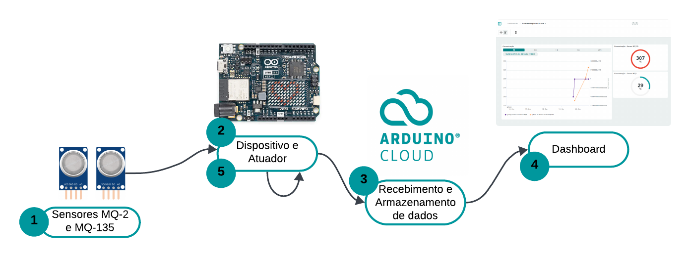
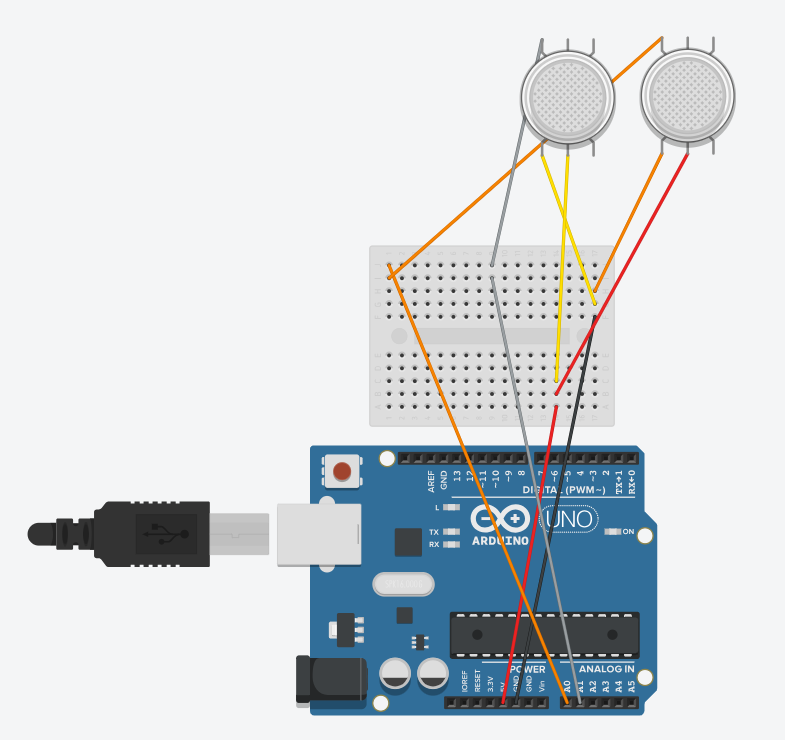

# Sistema de Detecção de Gases Industriais com Arduino e IoT :factory::dash:

## Descrição
Este projeto visa desenvolver um sistema de baixo custo para a detecção de gases tóxicos e inflamáveis em ambientes industriais, utilizando a plataforma Arduino e sensores como o MQ-2 e MQ-135. O sistema transmite dados via internet utilizando o protocolo MQTT, permitindo o monitoramento remoto das condições ambientais em tempo real.

## Configurações e Funcionamento
<ol>
    <li>Configuração do Sistema:</li>
        <ul>
            <li>Conecte os sensores de gás (MQ-2 e MQ-135) ao Arduino UNO R4 WiFi utilizando os pinos de entrada/saída.</li>
            <li>O Arduino será programado para ler as variações de tensão dos sensores, convertendo esses valores em concentrações de gases.</li>
            <li>O sistema utiliza o protocolo MQTT para enviar os dados para a nuvem, possibilitando o monitoramento remoto via internet.</li>
        </ul>
    <li>Funcionamento:</li>
        <ol>
            <li>Sensores de gás captam as concentrações de gases no ambiente. </li>
            <li>O Arduino UNO R4 Wi-Fi realiza a leitura dos sensores através das portas analógicas A0 e A1.</li>
            <li>As leituras de concentração de gás são enviadas para a plataforma Arduino Cloud através do protocolo MQTT, usando a classe ArduinoCloud. </li>
            <li>O valor da concentração de gás é automaticamente transmitido e armazenado no Arduino Cloud, podendo ser acessado remotamente. </li>
            <li>O Arduino utiliza esses dados para atualizar a matriz de LEDs, convertendo as leituras em uma representação visual. </li>
        </ol>
</ol>

## Software Desenvolvido
O código do sistema foi desenvolvido em C/C++ utilizando a plataforma Arduino Cloud. A principal funcionalidade é a leitura dos sensores MQ-2 e MQ-135 e o envio dos dados via protocolo MQTT para uma plataforma de monitoramento em nuvem.

O código e a documentação estão disponíveis no repositório deste projeto.

## Hardware
<ul>
    <li>Plataforma de Desenvolvimento: Arduino UNO R4 WiFi</li>
        <ul>
            <li>14 pinos digitais de entrada/saída, 6 entradas analógicas, conectividade WiFi.</li>
            <li>Matriz de LEDs 12x8 para exibição do status de gases detectados.</li>
        </ul>
    <li>Sensores:</li>
        <ul>
            <li>MQ-135: Sensor de gás para detectar gases tóxicos como amônia, benzeno, dióxido de carbono, entre outros.</li>
            <li>MQ-2: Sensor de gás para detectar gases inflamáveis como GLP, metano, propano, etc.</li>
        </ul>
    <li>Outros componentes</li>
        <ul>
            <li>Mini Protoboard para prototipagem.</li>
            <li>Jumpers e conectores para fazer as conexões necessárias entre o Arduino e os sensores.</li>
        </ul>
</ul>

## Comunicação, Protocolos e Módulos

## Protocolo MQTT
A integração entre o Arduino e o broker MQTT é realizada automaticamente através da plataforma Arduino Cloud, sem necessidade de configuração manual do broker. A comunicação é feita de maneira simplificada, usando a classe ArduinoCloud que gerencia a conexão com a nuvem e o envio de dados. No código, a inicialização do Arduino Cloud ocorre dentro da função setup(), por meio da chamada ArduinoCloud.begi(ArduinoIoTPreferredConnection), que configura a conexão com o broker MQTT da plataforma Arduino Cloud.

## Requisitos para a execução
<ul>
    <li>Hardware: Arduino UNO R4 WiFi, sensores MQ-2, MQ-135, mini protoboard.</li>
    <li>Software: Arduino Cloud.</li>
</ul>

## Como Reproduzir
### Passo 1: Modelo de montagem
Monte seu protótipo conforme o modelo de montagem a seguir. 

Vale ressaltar que o esquema abaixo é uma representação simplificada, pois softwares gratuitos não oferecem suporte ao modelo Arduino R4 Wi-Fi para a criação de circuitos online. 

### Passo 2: Configuração do Projeto no Arduino IoT Cloud
<ol>
    <li>Acesse o Arduino IoT Cloud:
        <ul>
            <li>Vá para <a href="https://app.arduino.cc/">Arduino IoT Cloud</a> e faça login com sua conta Arduino. Caso ainda não tenha uma conta, crie uma.
            </li>
        </ul>
    </li>
    <li>Crie um Novo "Thing":
        <ul>
            <li>Na tela principal do Arduino IoT Cloud, clique em <strong>Create New Thing</strong>.
            </li>
            <li>Dê um nome ao seu "Thing" (ex: "Monitoramento de Gás").
            </li>
            <li>Selecione a placa do projeto <strong>Arduino Uno R4</strong>.
            </li>
        </ul>
    </li>
    <li>Adicione as Variáveis de Nuvem:
        <ul>
            <li>Clique em <strong>Add Variable</strong>.</li>
            <li>Crie as variáveis <code>gasConcentrationMQ2</code> e <code>gasConcentrationMQ135</code>, ambas do tipo <code>int</code>. Marque essas variáveis como <strong>READWRITE</strong> (Ler e Escrever).</li>
        </ul>
    </li>
    <li>Configure a Network:
        <ul>
            <li>Adicione o nome e senha de sua rede.</li>
            <li>Clique em salvar.</li>
        </ul>
    </li>
    <li>Abra o menu Sketch:
        <ul>
            <li>Adicione dois arquivos e copie os códigos que estão na pasta src.</li>
        </ul>
    </li>
    <li>Instale as Bibliotecas Necessárias:
        <ul>
            <li>Ainda na aba de Sketch vá para o menu lateral esquerdo na opção de <strong>Libraries</strong></li>
            <li>Instale seguintes bibliotecas: <code>Arduino IoT Cloud</code> e <code>Arduino_LED_Matrix</code>.</li>
        </ul>
    </li>
    <li>Compile e carregue o código
        <ul>
            <li>No Arduino IDE, clique em Verificar (ícone de check) para compilar o código.</li>
            <li>Se a compilação for bem-sucedida, clique em Carregar (ícone de seta para a direita) para carregar o código na sua placa Arduino.</li>
        </ul>
    </li>
</ol>